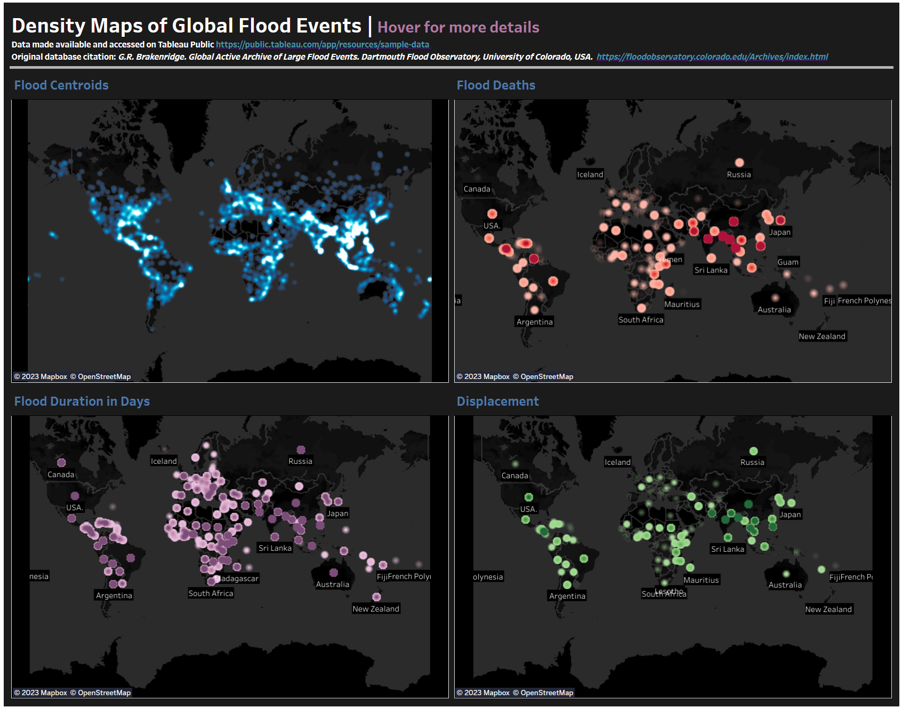

## Flood Analysis Tableau Dashboard
This repository links to the Density Maps of Global Flood Events dashboard. This dashboard is specifically targeting location of floods, so we can observe this through striking density maps in neon colors and a dark background. Instead of using layers that would require the user to select/deselect layers to see specfic detail, this dashboard shows all of the layers as seperate maps. Centroid, flood deaths, displacement, and home destruction are the focus of each map, respectively in order to show the most dangerous floods and thier locations. Hover over each map for further detail.

Sources/Citations:
Data made available and accessed on [Tableau Public](https://public.tableau.com/app/resources/sample-data) 

Original database citation: G.R. Brakenridge. Global Active Archive of Large Flood Events. Dartmouth Flood Observatory, University of Colorado, USA. [https://floodobservatory.colorado.edu/Archives/index.html](https://floodobservatory.colorado.edu/Archives/index.html)

[Density Maps of Global Flood Events by Kristi Bischoff](https://public.tableau.com/app/profile/kristi.bischoff/viz/GlobalFloodEvents_16836755584070/Dashboard1)

